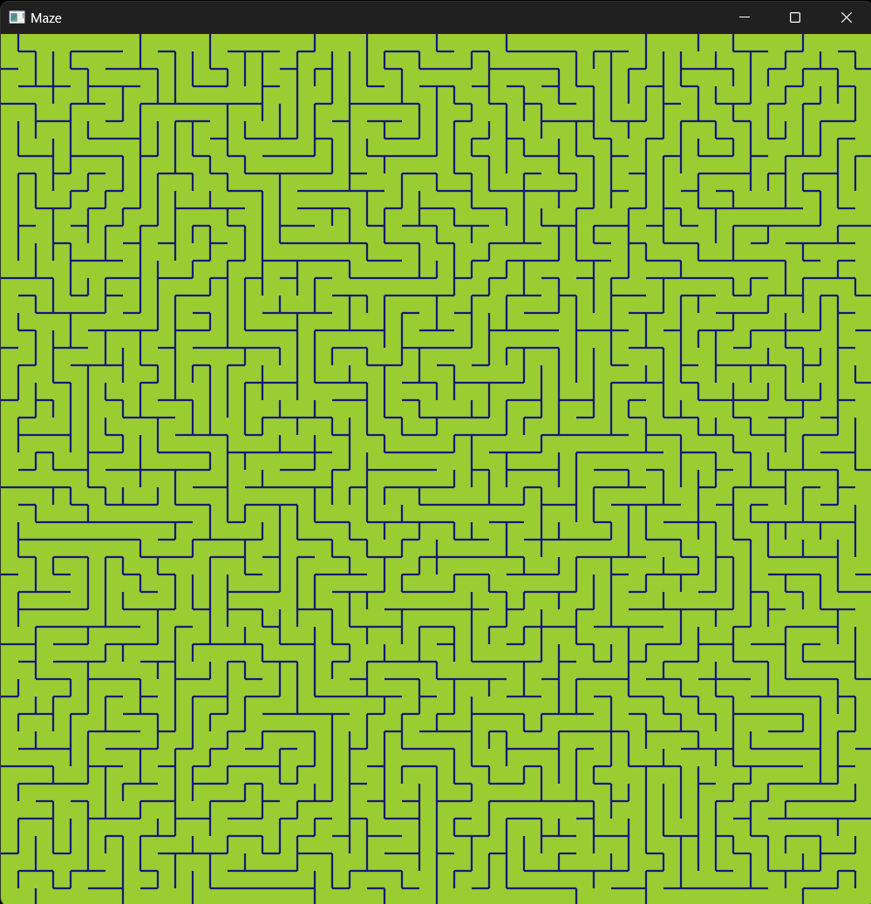

<h3>Maze generation using Bevy 0.15. The implementation is based on this video: https://www.youtube.com/watch?v=Y37-gB83HKE</h3>

I wrote this code to introduce my colleagues to Rust by implementing the maze.rs part using the tests I kept in the file on a long live coding session.

I have also planned a path finding intro, but I didn't finish that part of the project.